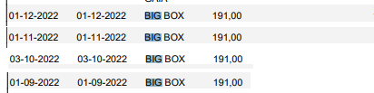
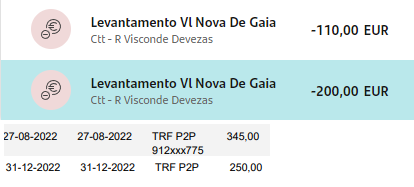

```{r, include = F}
knitr::opts_chunk$set(echo = F,
                      include = F,
                      warning = F,
                      message = F)
 options(scipen=1, digits=2)
 
library(dplyr) 
```


Partindo dos pressupostos que

1) A divisão da casa de Paredes de Coura foi feita equitativamente, o dinheiro entregue, estando esse ponto encerrado;

2) Tal como tem sido feito até agora, todas as despesas e receitas serão divididas pelos herdeiros na proporção de 5/8 para Ana Paula Rocha e 1/8 para cada um dos filhos de Alberto Rocha;

3) Após a divisão integral do dinheiro resultante da venda da casa de Afe, herança regressou à situação inicial de ausência de capital disponível. Como tal, as despesas incorridas por ela desde o falecimento de Alberto Rocha (Pai) foram, adiantadas por Ana Paula Rocha na qualidade de cabeça de casal da herança;

4) Após a liquidação das dívidas e créditos pessoais conforme acordado na correspondência anterior, esse adiantamento por Ana Paula Rocha traduz-se num balanço entre os herdeiros de:

```{r}
berto = -6013
xanda = -6013
crist = -6013
paula = -(berto + xanda + crist)
```

* Ana Paula Rocha: **`r paula` €**
* Alberto Rocha: **`r berto` €**
* Cristina Rocha: **`r crist` €**
* Nair Rocha: **`r xanda` €**

Com base neste ponto de partida, apresentam-se seguidamente propostas para a divisão do património móvel da herança, bem como ressarcimento das despesas incorridas pelos herdeiros no âmbito desta. O balanço existente referido acima será actualizado após cada divisão, reflectindo o valor que cabe a cada herdeiro. Como poderão ter notado, este documento é um markdown, podendo (e devendo), sendo por isso dinâmico e como tal não deve ser entendido como uma proposta estática e final. Propostas de valores e acréscimo de items por parte dos herdeiros serão facilmente implementadas.

#### Fiat Punto

Ana Paula Rocha propõe aos restantes herdeiros a aquisição do Fiat Punto (...) pelo valor de **`r punto = 3000; punto` €**. O balanço após esta transação será de 

```{r}
berto = berto + punto/8
xanda = xanda + punto/8
crist = crist + punto/8
paula = paula - 3/8*punto
```

* Ana Paula Rocha: **`r paula` €**
* Alberto Rocha: **`r berto` €**
* Cristina Rocha: **`r crist` €**
* Nair Rocha: **`r xanda` €**

#### Mitsubishi Pajero Pinin

Alberto Rocha propõe aos restantes herdeiros a aquisição do Mitsubishi Pajero Pinin (...) pelo valor de **`r pinin = 3000; pinin` €**. O balanço após esta transação será de 

```{r}
berto = berto + pinin*-7/8
xanda = xanda + pinin*1/8
crist = crist + pinin*1/8
paula = paula + pinin*5/8
```

* Ana Paula Rocha: **`r paula` €**
* Alberto Rocha: **`r berto` €**
* Cristina Rocha: **`r crist` €**
* Nair Rocha: **`r xanda` €**

#### Recheio da Maia e de Paredes de Coura

Ana Paula Rocha propõe aos restantes herdeiros a aquisição dos recheios das casa da Maia e Paredes de Coura pelo valor de **`r mobilia = 4000; mobilia` €**. O balanço após esta transação será de 

```{r}
berto = berto + mobilia*1/8
xanda = xanda + mobilia*1/8
crist = crist + mobilia*1/8
paula = paula + mobilia*-3/8
```

* Ana Paula Rocha: **`r paula` €**
* Alberto Rocha: **`r berto` €**
* Cristina Rocha: **`r crist` €**
* Nair Rocha: **`r xanda` €**

#### Despesas do Funeral

Alberto Rocha apresenta as despesas que assumiu com o funeral de Alberto Rocha (Pai), no valor de de **`r funeral = 5215.99; funeral` €**. Ana Paula Rocha recebeu para esse efeito um subsídio no valor de **`r subsidio = 1300.90; subsidio` €**, que será entregue a Alberto Rocha para liquidação da dívida à Agência Funerária. O valor restante da despesa (**`r funeral_subsidiado = funeral-subsidio;funeral_subsidiado` €**) será dividido entre os todos herdeiros. O balanço após esta transação será de 

```{r}
berto = berto + (funeral_subsidiado)*7/8 + subsidio
xanda = xanda + (funeral_subsidiado)*-1/8
crist = crist + (funeral_subsidiado)*-1/8
paula = paula + (funeral_subsidiado)*-5/8 - subsidio
```

* Ana Paula Rocha: **`r paula` €**
* Alberto Rocha: **`r berto` €**
* Cristina Rocha: **`r crist` €**
* Nair Rocha: **`r xanda` €**

#### Despesas de armazenamento do recheio de Paredes de Coura

Para que fosse possível a venda da casa de Paredes de Coura, foi necessário alugar um espaço de armazenamento para o recheio da mesma. Esse espaço foi usado entre Setembro e Dezembro de 2022, conforme apresentado em baixo. O valor total foi **`r bigbox = 764; bigbox` €**.



O balanço após esta transação será: 

```{r}
berto = berto + bigbox*7/8
xanda = xanda + bigbox*-1/8
crist = crist + bigbox*-1/8
paula = paula + bigbox*-5/8
```

* Ana Paula Rocha: **`r paula` €**
* Alberto Rocha: **`r berto` €**
* Cristina Rocha: **`r crist` €**
* Nair Rocha: **`r xanda` €**

#### Despesas com a mudança do recheio de Paredes de Coura

Para efeitos da venda da casa de Paredes de Coura, Ana Paula Rocha contratou os serviços da empresa de mudança José Alves em duas ocasiões: Mudança de Afe para a Big Box em Gaia e, posteriormente, da Big Box para a casa da Maia. Ambos os serviços foram pagos em dinheiros e os respectivos movimentos são apresentados seguidamente. Os primeiros 3 movimentos referem-se ao levantamento fraccionado de **655 €** devido ao limite de multibanco e mbway. O ultimo movimento corresponde à segunda mudança, no valor de **250 €**.



o valor total é **`r mudanca = 110 + 200 + 345 + 200; mudanca` €**. O balanço após esta transação será: 

```{r}
berto = berto + mudanca*-1/8
xanda = xanda + mudanca*-1/8
crist = crist + mudanca*-1/8
paula = paula + mudanca*3/8
```

* Ana Paula Rocha: **`r paula` €**
* Alberto Rocha: **`r berto` €**
* Cristina Rocha: **`r crist` €**
* Nair Rocha: **`r xanda` €**

## Resumo final da divisao

Seguidamente apresenta-se o resumo das operações consideradas anteriormente. A coluna 'check' soma as parcelas individuais de cada item. Todos os valores são em €, os valores diferentes de 0 resultam de erros de arredondamento.

```{r, include=T}
parcelas = c('inicial','punto','jipe','mudancas','bigbox','funeral','recheio')

paula_sum = c('inicial' = 18039,
              'punto' = -3/8*punto,
              'jipe' = 5/8*pinin,
              'mudancas' = 3/8*mudanca,
              'bigbox' = -5/8*bigbox,
              'funeral' = -5/8*(funeral_subsidiado)-subsidio,
              'recheio' = -3/8*mobilia)

berto_sum = c('inicial' = -6013,
              'punto' = 1/8*punto,
              'jipe' = -7/8*pinin,
              'mudancas' = -1/8*mudanca,
              'bigbox' = 7/8*bigbox,
              'funeral' = 7/8*funeral_subsidiado + subsidio,
              'recheio' = 1/8*mobilia)

crist_sum = c('inicial' = -6013,
              'punto' = 1/8*punto,
              'jipe' = 1/8*pinin,
              'mudancas' = -1/8*mudanca,
              'bigbox' = -1/8*bigbox,
              'funeral' = -1/8*funeral_subsidiado,
              'recheio' = 1/8*mobilia)

xanda_sum = c('inicial' = -6013,
              'punto' = 1/8*punto,
              'jipe' = 1/8*pinin,
              'mudancas' = -1/8*mudanca,
              'bigbox' = -1/8*bigbox,
              'funeral' = -1/8*funeral_subsidiado,
              'recheio' = 1/8*mobilia)

sumario = data.frame(cbind(paula_sum,
                           berto_sum,
                           crist_sum,
                           xanda_sum))

names(sumario) = c('AnaPaula', 'Alberto', 'Cristina', 'Nair')

sumario = 
sumario %>% 
 add_row('AnaPaula' = sum(.$AnaPaula),
         'Alberto' = sum(.$Alberto),
         'Cristina' = sum(.$Cristina),
         'Nair' = sum(.$Nair)) %>% 
  mutate(Check = AnaPaula + Alberto + Cristina + Nair %>% trunc(0) )

rownames(sumario)[nrow(sumario)] = 'Total'

sumario
```

Propõe-se assim que, estando todas as partes de acordo com as divisões propostas acima e o apuramento dos respectivos balanços, sejam liquidadas as diferenças apuradas. Ficarão assim concluídas as partilhas da herança de Alberto Rocha, com excepção da casa da Maia, que é discutida em seguida.

## Divisão da Casa da Maia

Propõe-se que a casa da Maia seja avaliada por um avaliador acreditado pela CMVM, escolhido da lista apresentada em https://web3.cmvm.pt/sdi/peritos/peritos.cfm. O valor resultante dessa avaliação caberá a cada um dos herdeiros, na proporção habitual (5-1-1-1).

Para a concretização da divisão da casa urge acordar no avaliador e proceder à avaliação, uma vez que sem o resultado da mesma é impossível prosseguir. Pede-se aos herdeiros que se pronunciem sobre a escolha do avaliador. Uma vez obtida a avaliação, será apresentada uma proposta de execução da divisão.


