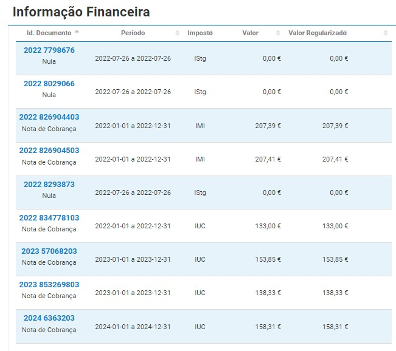

```{r, include = F}
knitr::opts_chunk$set(echo = F,
                      include = F,
                      warning = F,
                      message = F)

options(scipen=8, digits=2)
 
library(dplyr) 
```


# Intro

Partindo dos pressupostos que

1) Todas as despesas e receitas serão divididas pelos herdeiros na proporção de 5/8 para Ana Paula Rocha e 1/8 para cada um dos filhos de Alberto Rocha;

2) A divisão da casa de Paredes de Coura foi feita equitativamente, tendo o imóvel sido vendido por **`r casa_coura = 178000; casa_coura`** €. Após dedução da comissão da agência imobiliária (5% + 23% IVA) e da taxa Adene para o acto da escritura (258.92 €), cada herdeiro recebeu: 

* Ana Paula Rocha: **`r (casa_coura -0)*(1-0.0615)*5/8 -5*258.92/8` €**
* Alberto Rocha: **`r (casa_coura -0)*(1-0.0615)/8 -258.92/8` €**
* Cristina Rocha: **`r (casa_coura -0)*(1-0.0615)/8 -258.92/8` €**
* Nair Rocha: **`r (casa_coura-0)*(1-0.0615)/8 -258.92/8` €**

Conforme acordado, estes valores já foram entregues a cada herdeiro.

3) Após a divisão integral do dinheiro resultante da venda da casa de Afe, herança regressou à situação inicial de ausência de capital disponível. Como tal, as despesas incorridas por ela desde o falecimento de Alberto Rocha (Pai) foram adiantadas por Ana Paula Rocha na qualidade de cabeça de casal da herança.

Numa primeira fase, foi realizado o pagamento de dívidas e créditos pendentes. A documentação e comprovativos referentes a esses pagamentos foram comunicados e aprovados por e-mail previamente. É apresentado um resumo dos valores liquidados nesta fase:

```{r, include = T}

# velho = data.frame(matrix(NA, nrow = 6, ncol = 1))
Item = c('Liq. Oney 1',
           'Liq. Oney 2',
           'Liq. Wizink 1',
           'Prest. Oney',
           'Prest. Wizink',
           'Divida a Luis Miguel')

Valor = c(4394.72,
          5104.68,
          8311.46,
          2091.97,
          3197.84,
          25000) %>% as.numeric()

velho = data.frame(matrix(Valor))
names(velho) = c('Valor')
row.names(velho) = Item 

velho$Valor = Valor %>% as.numeric()

velho['Total',] = colSums(velho)
velho['1/8',] = velho['Total',]/8

velho
```

4) Após a liquidação das dívidas e créditos pessoais referidos no ponto anterior, esse adiantamento por Ana Paula Rocha traduz-se num balanço entre os herdeiros de:

```{r}
berto = -6013
xanda = -6013
crist = -6013
paula = -(berto + xanda + crist)
```

* Ana Paula Rocha: **`r paula` €**
* Alberto Rocha: **`r berto` €**
* Cristina Rocha: **`r crist` €**
* Nair Rocha: **`r xanda` €**

Com base neste ponto de partida, apresentam-se seguidamente propostas para a divisão do património móvel da herança, para o ressarcimento das despesas incorridas pelos herdeiros no âmbito desta e para a divisão da casa da Maia. O balanço existente referido acima será actualizado após cada divisão, reflectindo o valor que cabe a cada herdeiro. Como poderão ter notado, este documento é um markdown, sendo por isso dinâmico e como tal não deve ser entendido como uma proposta estática e final. Propostas de valores e acréscimo de items por parte dos herdeiros serão facilmente implementadas.

# Items

## Despesas com encerramento de contas

Devido à imposição legal de encerramento de contas em que Alberto Rocha era titular, foi necessário regularizar os saldos a descoberto à data do encerramento da conta Santander à ordem (**`r santander_ordem=2528.01; santander_ordem` €**) e de um cartão crédito no Santander no valor de **`r santander_credito = 1000; santander_credito` €**. O acerto de contas referente a estes encerramentos resulta em: 

```{r}
berto = berto - (santander_ordem + santander_credito)/8
xanda = xanda - (santander_ordem + santander_credito)/8
crist = crist - (santander_ordem + santander_credito)/8
paula = paula + 3*(santander_ordem + santander_credito)/8
```

* Ana Paula Rocha: **`r paula` €**
* Alberto Rocha: **`r berto` €**
* Cristina Rocha: **`r crist` €**
* Nair Rocha: **`r xanda` €**

## Fiat Punto

Foi pedida a avaliação do estado da viatura a Nelson Ribeiro, da MOTORVAP - Hyundai Porto. O valor estimado de mercado para a mesma foi de 1800 €. 


Levando esta avaliação em conta, Ana Paula Rocha propõe aos restantes herdeiros a aquisição do Fiat Punto pelo valor de **`r punto = 3000; punto` €**. O balanço após esta transação será de 

```{r}
berto = berto + punto/8
xanda = xanda + punto/8
crist = crist + punto/8
paula = paula - 3/8*punto
```

* Ana Paula Rocha: **`r paula` €**
* Alberto Rocha: **`r berto` €**
* Cristina Rocha: **`r crist` €**
* Nair Rocha: **`r xanda` €**

## Mitsubishi Pajero Pinin

Foi pedida a avaliação do estado da viatura a Nelson Ribeiro, da MOTORVAP - Hyundai Porto. O valor estimado de mercado para a mesma foi de 1800 €. 


Alberto Rocha propõe aos restantes herdeiros a aquisição do Mitsubishi Pajero Pinin pelo valor de **`r pinin = 3000; pinin` €**. O balanço após esta transação será de 

```{r}
berto = berto + pinin*-7/8
xanda = xanda + pinin*1/8
crist = crist + pinin*1/8
paula = paula + pinin*5/8
```

* Ana Paula Rocha: **`r paula` €**
* Alberto Rocha: **`r berto` €**
* Cristina Rocha: **`r crist` €**
* Nair Rocha: **`r xanda` €**

## Recheio da Maia e de Paredes de Coura

Ana Paula Rocha propõe aos restantes herdeiros a aquisição dos recheios das casa da Maia e Paredes de Coura pelo valor de **`r mobilia = 4000; mobilia` €**. O balanço após esta transação será de 

```{r}
berto = berto + mobilia*1/8
xanda = xanda + mobilia*1/8
crist = crist + mobilia*1/8
paula = paula + mobilia*-3/8
```

* Ana Paula Rocha: **`r paula` €**
* Alberto Rocha: **`r berto` €**
* Cristina Rocha: **`r crist` €**
* Nair Rocha: **`r xanda` €**

## Despesas do Funeral

Alberto Rocha apresenta as despesas que assumiu com o funeral de Alberto Rocha (Pai), no valor de de **`r funeral = 5215.99; funeral` €**. Ana Paula Rocha recebeu para esse efeito um subsídio no valor de **`r subsidio = 1329.60; subsidio` €**, que será entregue a Alberto Rocha para liquidação da dívida à Agência Funerária. O valor restante da despesa (**`r funeral_subsidiado = funeral-subsidio;funeral_subsidiado` €**) será dividido entre os todos herdeiros. O balanço após esta transação será de 

```{r}
berto = berto + (funeral_subsidiado)*7/8 + subsidio
xanda = xanda + (funeral_subsidiado)*-1/8
crist = crist + (funeral_subsidiado)*-1/8
paula = paula + (funeral_subsidiado)*-5/8 - subsidio
```

* Ana Paula Rocha: **`r paula` €**
* Alberto Rocha: **`r berto` €**
* Cristina Rocha: **`r crist` €**
* Nair Rocha: **`r xanda` €**

## Despesas de armazenamento do recheio de Paredes de Coura

Para que fosse possível a venda da casa de Paredes de Coura, foi necessário alugar um espaço de armazenamento para o recheio da mesma. Esse espaço foi usado entre Setembro e Dezembro de 2022, conforme apresentado em baixo. O valor total foi **`r bigbox = 764; bigbox` €**.


O balanço após esta transação será: 

```{r}
berto = berto + bigbox*7/8
xanda = xanda + bigbox*-1/8
crist = crist + bigbox*-1/8
paula = paula + bigbox*-5/8
```

* Ana Paula Rocha: **`r paula` €**
* Alberto Rocha: **`r berto` €**
* Cristina Rocha: **`r crist` €**
* Nair Rocha: **`r xanda` €**

## Despesas com a mudança do recheio de Paredes de Coura

Para efeitos da venda da casa de Paredes de Coura, Ana Paula Rocha contratou os serviços da empresa de mudança José Alves em duas ocasiões: Mudança de Afe para a Big Box em Gaia e, posteriormente, da Big Box para a casa da Maia. Ambos os serviços foram pagos em dinheiros e os respectivos movimentos são apresentados seguidamente. Os primeiros 3 movimentos referem-se ao levantamento fraccionado de **655 €** devido ao limite de multibanco e mbway. O ultimo movimento corresponde à segunda mudança, no valor de **250 €**.


o valor total é **`r mudanca = 110 + 200 + 345 + 250; mudanca` €**. O balanço após esta transação será: 

```{r}
berto = berto + mudanca*-1/8
xanda = xanda + mudanca*-1/8
crist = crist + mudanca*-1/8
paula = paula + mudanca*3/8
```

* Ana Paula Rocha: **`r paula` €**
* Alberto Rocha: **`r berto` €**
* Cristina Rocha: **`r crist` €**
* Nair Rocha: **`r xanda` €**

## Despesas de Águas e Saneamento de Paredes de Coura

Ana Paula Rocha apresenta à Herança as despesas com Água e Saneamento, electricidade, contrato de telecomunicações (NOS) e jardinagem e da casa de Paredes de Coura, incorridas até à venda da mesma. As despesas com jardinagem foram **`r jardineiro = 240; jardineiro` €**. As restantes despesas consistem de mensalidades e estão discriminadas em seguida:

```{r, include = T}
agua_coura = data.frame('Mes' = c('Junho', 'Julho', 'Agosto', 'Setembro', 'Outubro','Novembro'),
                        'Agua' = c(4.90, 9.22, 4.34, NA, 1.05, NA),
                        'Electridade' = c(26.13, 25.94, 26.46, 26.95, 25.46, 10.92),
                        'NOS' = c(36.29, NA, NA, NA, NA, NA)) 


agua_coura
```

para um total de **`r agua = jardineiro + sum(agua_coura$Agua, na.rm=T) + sum(agua_coura$Electridade) + sum(agua_coura$NOS, na.rm =T);agua` €**. O balanço após esta transação será: 

```{r}
berto = berto + agua*-1/8
xanda = xanda + agua*-1/8
crist = crist + agua*-1/8
paula = paula + agua*3/8
```

* Ana Paula Rocha: **`r paula` €**
* Alberto Rocha: **`r berto` €**
* Cristina Rocha: **`r crist` €**
* Nair Rocha: **`r xanda` €**

## Despesas legais

Ana Paula Rocha apresenta despesas incorridas com Notária (**`r notaria = 246.74;notaria` €**) e Advogada (**`r advogada  = 250;advogada` €**) aquando do processo de habilitação de herdeiros. Acrescenta ainda custos com certidões no valor de **`r certidoes = 60;certidoes` €**. O balanço após esta transação será `r legais = advogada + notaria + certidoes`: 

```{r}
berto = berto + legais*-1/8
xanda = xanda + legais*-1/8
crist = crist + legais*-1/8
paula = paula + legais*3/8
```

* Ana Paula Rocha: **`r paula` €**
* Alberto Rocha: **`r berto` €**
* Cristina Rocha: **`r crist` €**
* Nair Rocha: **`r xanda` €**


## Encargos com manutenção das viaturas e casa da Maia durante período de partilhas

No período em que as viaturas permaneceram em nome da herança, Ana Paula Rocha apresenta os seguintes encargos nos quais incorreu:

Imposto Único de Circulação do Fiat Punto:


Imposto Único de Circulação do Mitsubishi Pajero Pinin:

Imposto Municipal sobre Imóveis da casa da Maia (linhas 3 e 4):


Estas despesas totalizam **`r impostos = 153.85 + 133 + 414.80;impostos`**, € sendo o balanço dos herdeiros após a sua contabilização o seguinte:

```{r}
berto = berto + impostos*-1/8
xanda = xanda + impostos*-1/8
crist = crist + impostos*-1/8
paula = paula + impostos*3/8
```

* Ana Paula Rocha: **`r paula` €**
* Alberto Rocha: **`r berto` €**
* Cristina Rocha: **`r crist` €**
* Nair Rocha: **`r xanda` €**
 
## Despesas de avaliação da casa da Maia

Ana Paula Rocha apresenta despesas relativas à avaliação formal da casa da Maia através de peritos certificados pela Comissão de Mercado de Valores Mobiliários (**CMVM**), pelo valor de **`r avaliacao_cmvm = 307.5; avaliacao_cmvm`** €. Foi também solicitada ao avaliador um certificado energético, cuja fatura (**`r certificado_energetico = 301.35; certificado_energetico`** €) também se apresenta:

Avaliação CMVM do imóvel: 


Emissão do certificado energético: 


A inclusão destas despesas resulta no seguinte balanço:

```{r}
avaliacoes_imovel = (certificado_energetico + avaliacao_cmvm)
berto = berto + (avaliacoes_imovel)*-1/8
xanda = xanda + (avaliacoes_imovel)*-1/8
crist = crist + (avaliacoes_imovel)*-1/8
paula = paula + (avaliacoes_imovel)*3/8
```

* Ana Paula Rocha: **`r paula` €**
* Alberto Rocha: **`r berto` €**
* Cristina Rocha: **`r crist` €**
* Nair Rocha: **`r xanda` €**
 
# Resumo final da divisao

Seguidamente apresenta-se o resumo das operações consideradas anteriormente. A coluna 'check' soma as parcelas individuais de cada item. Todos os valores são em €, os valores diferentes de 0 resultam de erros de arredondamento.

```{r, include=T}
parcelas = c('inicial','santander_ordem','santander_credito',
             'punto','jipe','mudancas',
             'bigbox','funeral',
             'recheio','coura','despesas legais',
             'impostos','avaliacoes')

paula_sum = c('inicial' = 18039,
              'santander_ordem' = 3/8*santander_ordem,
              'santander_credito' = 3/8*santander_credito,
              'punto' = -3/8*punto,
              'jipe' = 5/8*pinin,
              'mudancas' = 3/8*mudanca,
              'bigbox' = -5/8*bigbox,
              'funeral' = -5/8*(funeral_subsidiado)-subsidio,
              'recheio' = -3/8*mobilia,
              'coura' = 3/8*agua,
              'despesas legais' = 3/8*legais,
              'impostos' = 3/8 * impostos,
              'avaliacoes' = 3/8 * avaliacoes_imovel)

berto_sum = c('inicial' = -6013,
              'santander_ordem' = -1/8*santander_ordem,
              'santander_credito' = -1/8*santander_credito,
              'punto' = 1/8*punto,
              'jipe' = -7/8*pinin,
              'mudancas' = -1/8*mudanca,
              'bigbox' = 7/8*bigbox,
              'funeral' = 7/8*funeral_subsidiado + subsidio,
              'recheio' = 1/8*mobilia,
              'coura' = -1/8*agua,
              'despesas legais' = -1/8*legais,
              'impostos' = -1/8 * impostos,
              'avaliacoes' = -1/8 * avaliacoes_imovel)

crist_sum = c('inicial' = -6013,
              'santander_ordem' = -1/8*santander_ordem,
              'santander_credito' = -1/8*santander_credito,
              'punto' = 1/8*punto,
              'jipe' = 1/8*pinin,
              'mudancas' = -1/8*mudanca,
              'bigbox' = -1/8*bigbox,
              'funeral' = -1/8*funeral_subsidiado,
              'recheio' = 1/8*mobilia,
              'coura' = -1/8*agua,
              'despesas legais' = -1/8*legais,
              'impostos' = -1/8 * impostos,
              'avaliacoes' = -1/8 * avaliacoes_imovel)

xanda_sum = c('inicial' = -6013,
              'santander_ordem' = -1/8*santander_ordem,
              'santander_credito' = -1/8*santander_credito,
              'punto' = 1/8*punto,
              'jipe' = 1/8*pinin,
              'mudancas' = -1/8*mudanca,
              'bigbox' = -1/8*bigbox,
              'funeral' = -1/8*funeral_subsidiado,
              'recheio' = 1/8*mobilia,
              'coura' = -1/8*agua,
              'despesas legais' = -1/8*legais,
              'impostos' = -1/8 * impostos,
              'avaliacoes' = -1/8 * avaliacoes_imovel)

sumario = data.frame(cbind(paula_sum,
                           berto_sum,
                           crist_sum,
                           xanda_sum))

names(sumario) = c('AnaPaula', 'Alberto', 'Cristina', 'Nair')

sumario = 
sumario %>% 
 add_row('AnaPaula' = sum(.$AnaPaula),
         'Alberto' = sum(.$Alberto),
         'Cristina' = sum(.$Cristina),
         'Nair' = sum(.$Nair)) %>% 
  mutate(Check = AnaPaula + Alberto + Cristina + Nair %>% trunc(0) )

rownames(sumario)[nrow(sumario)] = 'Total'

sumario
```

Propõe-se assim que, estando todas as partes de acordo com as divisões propostas acima e o apuramento dos respectivos balanços, sejam liquidadas as diferenças apuradas. Ficarão assim concluídas as partilhas da herança de Alberto Rocha, com excepção da casa da Maia, que é discutida em seguida.

# Divisão da Casa da Maia

A casa da Maia foi avaliada por um perito certificado pela CMVM cujos serviços estão disponíveis em https://amsprojetos.pt/. O valor estimado para efeitos de partilha é de **`r casa_maia  = 255000; casa_maia` €**. A análise que fundamenta esta avaliação bem como o certificado energético que foi pedido paralelamente estarão disponibilizados a todas as partes interessadas.

Com base nesse valor, Ana Paula Rocha propõe aos restantes herdeiros adquirir por tornas as suas partes da casa da maia, pelo valor de **`r torna = casa_maia/8;torna`** € a cada um, valor correspondente a 1/8 do valor estimado. Acrescentando o balanço anterior, cada herdeiro receberá assim, como total da partilha da herança de Alberto Rocha e acrescendo à divisão da casa de Afe, o valor de :

* Alberto Rocha: **`r torna + berto` €**
* Cristina Rocha: **`r torna + crist` €**
* Nair Rocha: **`r torna +xanda` €**

Com a entrega destes valores por parte de Ana Paula Rocha a cada um dos restantes herdeiros, ficaria assim concluido o processo de partilhas da herança de Alberto Rocha.


