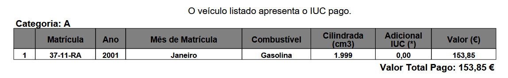
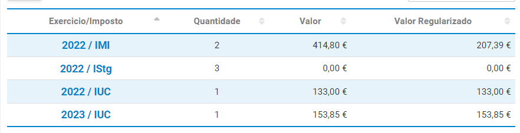

Divisão da Herança de Alberto Rocha
================

# Intro

Partindo dos pressupostos que

1)  Todas as despesas e receitas serão divididas pelos herdeiros na
    proporção de 5/8 para Ana Paula Rocha e 1/8 para cada um dos filhos
    de Alberto Rocha;

2)  A divisão da casa de Paredes de Coura foi feita equitativamente,
    tendo o imóvel sido vendido por **178000** €. Após dedução da
    comissão da agência imobiliária (5% + 23% IVA) e da taxa Adene para
    o acto da escritura (258.92 €), cada herdeiro recebeu:

- Ana Paula Rocha: **104246.3 €**
- Alberto Rocha: **20849.26 €**
- Cristina Rocha: **20849.26 €**
- Nair Rocha: **20849.26 €**

Conforme acordado, estes valores já foram entregues a cada herdeiro.

3)  Após a divisão integral do dinheiro resultante da venda da casa de
    Afe, herança regressou à situação inicial de ausência de capital
    disponível. Como tal, as despesas incorridas por ela desde o
    falecimento de Alberto Rocha (Pai) foram adiantadas por Ana Paula
    Rocha na qualidade de cabeça de casal da herança.

Numa primeira fase, foi realizado o pagamento de dívidas e créditos
pendentes. A documentação e comprovativos referentes a esses pagamentos
foram comunicados e aprovados por e-mail previamente. É apresentado um
resumo dos valores liquidados nesta fase:

    ##                      Valor
    ## Liq. Oney 1           4395
    ## Liq. Oney 2           5105
    ## Liq. Wizink 1         8311
    ## Prest. Oney           2092
    ## Prest. Wizink         3198
    ## Divida a Luis Miguel 25000
    ## Total                48101
    ## 1/8                   6013

4)  Após a liquidação das dívidas e créditos pessoais referidos no ponto
    anterior, esse adiantamento por Ana Paula Rocha traduz-se num
    balanço entre os herdeiros de:

- Ana Paula Rocha: **18039 €**
- Alberto Rocha: **-6013 €**
- Cristina Rocha: **-6013 €**
- Nair Rocha: **-6013 €**

Com base neste ponto de partida, apresentam-se seguidamente propostas
para a divisão do património móvel da herança, para o ressarcimento das
despesas incorridas pelos herdeiros no âmbito desta e para a divisão da
casa da Maia. O balanço existente referido acima será actualizado após
cada divisão, reflectindo o valor que cabe a cada herdeiro. Como poderão
ter notado, este documento é um markdown, sendo por isso dinâmico e como
tal não deve ser entendido como uma proposta estática e final. Propostas
de valores e acréscimo de items por parte dos herdeiros serão facilmente
implementadas.

# Items

## Fiat Punto

Foi pedida a avaliação do estado da viatura a Nelson Ribeiro, da
MOTORVAP - Hyundai Porto. O valor estimado de mercado para a mesma foi
de 1800 €.

Levando esta avaliação em conta, Ana Paula Rocha propõe aos restantes
herdeiros a aquisição do Fiat Punto pelo valor de **2000 €**. O balanço
após esta transação será de

- Ana Paula Rocha: **17289 €**
- Alberto Rocha: **-5763 €**
- Cristina Rocha: **-5763 €**
- Nair Rocha: **-5763 €**

## Mitsubishi Pajero Pinin

Foi pedida a avaliação do estado da viatura a Nelson Ribeiro, da
MOTORVAP - Hyundai Porto. O valor estimado de mercado para a mesma foi
de 1800 €.

Alberto Rocha propõe aos restantes herdeiros a aquisição do Mitsubishi
Pajero Pinin pelo valor de **2000 €**. O balanço após esta transação
será de

- Ana Paula Rocha: **18539 €**
- Alberto Rocha: **-7513 €**
- Cristina Rocha: **-5513 €**
- Nair Rocha: **-5513 €**

## Recheio da Maia e de Paredes de Coura

Ana Paula Rocha propõe aos restantes herdeiros a aquisição dos recheios
das casa da Maia e Paredes de Coura pelo valor de **4000 €**. O balanço
após esta transação será de

- Ana Paula Rocha: **17039 €**
- Alberto Rocha: **-7013 €**
- Cristina Rocha: **-5013 €**
- Nair Rocha: **-5013 €**

## Despesas do Funeral

Alberto Rocha apresenta as despesas que assumiu com o funeral de Alberto
Rocha (Pai), no valor de de **5215.99 €**. Ana Paula Rocha recebeu para
esse efeito um subsídio no valor de **1329.6 €**, que será entregue a
Alberto Rocha para liquidação da dívida à Agência Funerária. O valor
restante da despesa (**3886.39 €**) será dividido entre os todos
herdeiros. O balanço após esta transação será de

- Ana Paula Rocha: **13280.41 €**
- Alberto Rocha: **-2282.81 €**
- Cristina Rocha: **-5498.8 €**
- Nair Rocha: **-5498.8 €**

## Despesas de armazenamento do recheio de Paredes de Coura

Para que fosse possível a venda da casa de Paredes de Coura, foi
necessário alugar um espaço de armazenamento para o recheio da mesma.
Esse espaço foi usado entre Setembro e Dezembro de 2022, conforme
apresentado em baixo. O valor total foi **764 €**.

O balanço após esta transação será:

- Ana Paula Rocha: **12802.91 €**
- Alberto Rocha: **-1614.31 €**
- Cristina Rocha: **-5594.3 €**
- Nair Rocha: **-5594.3 €**

## Despesas com a mudança do recheio de Paredes de Coura

Para efeitos da venda da casa de Paredes de Coura, Ana Paula Rocha
contratou os serviços da empresa de mudança José Alves em duas ocasiões:
Mudança de Afe para a Big Box em Gaia e, posteriormente, da Big Box para
a casa da Maia. Ambos os serviços foram pagos em dinheiros e os
respectivos movimentos são apresentados seguidamente. Os primeiros 3
movimentos referem-se ao levantamento fraccionado de **655 €** devido ao
limite de multibanco e mbway. O ultimo movimento corresponde à segunda
mudança, no valor de **250 €**.

o valor total é **905 €**. O balanço após esta transação será:

- Ana Paula Rocha: **13142.28 €**
- Alberto Rocha: **-1727.43 €**
- Cristina Rocha: **-5707.42 €**
- Nair Rocha: **-5707.42 €**

## Despesas de Águas e Saneamento de Paredes de Coura

Ana Paula Rocha apresenta à Herança as despesas com Água e Saneamento,
electricidade, contrato de telecomunicações (NOS) e jardinagem e da casa
de Paredes de Coura, incorridas até à venda da mesma. As despesas com
jardinagem foram **240 €**. As restantes despesas consistem de
mensalidades e estão discriminadas em seguida:

    ##        Mes Agua Electridade NOS
    ## 1    Junho  4.9          26  36
    ## 2    Julho  9.2          26  NA
    ## 3   Agosto  4.3          26  NA
    ## 4 Setembro   NA          27  NA
    ## 5  Outubro  1.0          25  NA
    ## 6 Novembro   NA          11  NA

para um total de **437.66 €**. O balanço após esta transação será:

- Ana Paula Rocha: **13306.4 €**
- Alberto Rocha: **-1782.14 €**
- Cristina Rocha: **-5762.13 €**
- Nair Rocha: **-5762.13 €**

## Despesas legais

Ana Paula Rocha apresenta despesas incorridas com Notária (**246.74 €**)
e Advogada (**250 €**) aquando do processo de habilitação de herdeiros.
Acrescenta ainda custos com certidões no valor de **60 €**. O balanço
após esta transação será :

- Ana Paula Rocha: **13515.18 €**
- Alberto Rocha: **-1851.73 €**
- Cristina Rocha: **-5831.72 €**
- Nair Rocha: **-5831.72 €**

## Encargos com manutenção das viaturas e casa da Maia durante período de partilhas

No período em que as viaturas permaneceram em nome da herança, Ana Paula
Rocha apresenta os seguintes encargos nos quais incorreu:

Imposto Único de Circulação do Fiat Punto:

Imposto Único de Circulação do Mitsubishi Pajero Pinin:
 Imposto Municipal sobre Imóveis da
casa da Maia (primeira linha): 

Estas despesas totalizam **494.24**, € sendo o balanço dos herdeiros
após a sua contabilização o seguinte:

- Ana Paula Rocha: **13700.52 €**
- Alberto Rocha: **-1913.51 €**
- Cristina Rocha: **-5893.5 €**
- Nair Rocha: **-5893.5 €**

# Resumo final da divisao

Seguidamente apresenta-se o resumo das operações consideradas
anteriormente. A coluna ‘check’ soma as parcelas individuais de cada
item. Todos os valores são em €, os valores diferentes de 0 resultam de
erros de arredondamento.

    ##                 AnaPaula Alberto Cristina  Nair Check
    ## inicial            18039   -6013    -6013 -6013  0.00
    ## punto               -750     250      250   250  0.00
    ## jipe                1250   -1750      250   250  0.00
    ## mudancas             339    -113     -113  -113  0.12
    ## bigbox              -478     668      -96   -96  0.50
    ## funeral            -3759    4730     -486  -486  0.80
    ## recheio            -1500     500      500   500  0.00
    ## coura                164     -55      -55   -55  0.71
    ## despesas legais      209     -70      -70   -70  0.59
    ## impostos             185     -62      -62   -62  0.78
    ## Total              13701   -1914    -5894 -5894  0.50

Propõe-se assim que, estando todas as partes de acordo com as divisões
propostas acima e o apuramento dos respectivos balanços, sejam
liquidadas as diferenças apuradas. Ficarão assim concluídas as partilhas
da herança de Alberto Rocha, com excepção da casa da Maia, que é
discutida em seguida.

# Divisão da Casa da Maia

A casa da Maia foi avaliada por um perito certificado pela CMVM cujos
serviços estão disponíveis em <https://amsprojetos.pt/>. O valor
estimado para efeitos de partilha é de **255000 €**. A análise que
fundamenta esta avaliação bem como o certificado energético que foi
pedido paralelamente estarão disponibilizados a todas as partes
interessadas.

Com base nesse valor, Ana Paula Rocha propõe aos restantes herdeiros
adquirir por tornas as suas partes da casa da maia, pelo valor de
**31875** € a cada um, valor correspondente a 1/8 do valor estimado.
Acrescentando o balanço anterior, cada herdeiro receberá assim, como
total da partilha da herança de Alberto Rocha e acrescendo à divisão da
casa de Afe, o valor de :

- Alberto Rocha: **29961.49 €**
- Cristina Rocha: **25981.5 €**
- Nair Rocha: **25981.5 €**

Com a entrega destes valores por parte de Ana Paula Rocha a cada um dos
restantes herdeiros, ficaria assim concluido o processo de partilhas da
herança de Alberto Rocha.
