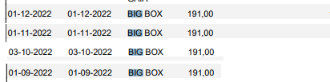

Divisão da Herança de Alberto Rocha
================

Partindo dos pressupostos que

1)  A divisão da casa de Paredes de Coura foi feita equitativamente, o
    dinheiro entregue e esse ponto encerrado;

2)  Tal como tem sido feito até agora, todas as despesas e receitas
    serão divididas pelos herdeiros na proporção de 5/8 para Ana Paula
    Rocha e 1/8 para cada um dos filhos de Alberto Rocha;

3)  A herança não possui capital disponível. Como tal, as despesas
    incorridas por ela desde o falecimento de Alberto Rocha (Pai) foram
    adiantadas por Ana Paula Rocha;

Temos que o balanço de cada um dos herdeiros relativamente à herança,
após a liquidação das dívidas e créditos pessoais mencionadas no
documento anterior, é:

- Ana Paula Rocha: **18039 €**
- Alberto Rocha: **-6013 €**
- Cristina Rocha: **-6013 €**
- Nair Rocha: **-6013 €**

Com base neste ponto de partida, apresentam-se seguidamente propostas
para a divisão do património móvel da herança, bem como ressarcimento
das despesas incorridas pelos herdeiros no âmbito desta. Como poderão
ter notado, este documento é um markdown, podendo (e devendo) ser
editado e actualizado de forma trivial. Desde já encorajam-se os
herdeiros a acrescentar items e sugerir alterações conforme relevante.

#### Fiat Punto

Ana Paula Rocha propõe aos restantes herdeiros a aquisição do Fiat Punto
(…) pelo valor de **3000 €**. O balanço após esta transação será de

- Ana Paula Rocha: **15414 €**
- Alberto Rocha: **-5638 €**
- Cristina Rocha: **-5638 €**
- Nair Rocha: **-5638 €**

#### Mitsubishi Pajero Pinin

Alberto Rocha propõe aos restantes herdeiros a aquisição do Mitsubishi
Pajero Pinin (…) pelo valor de **3000 €**. O balanço após esta transação
será de

- Ana Paula Rocha: **15789 €**
- Alberto Rocha: **-8263 €**
- Cristina Rocha: **-5263 €**
- Nair Rocha: **-5263 €**

#### Recheio da Maia e de Paredes de Coura

Ana Paula Rocha propõe aos restantes herdeiros a aquisição dos recheios
das casa da Maia e Paredes de Coura pelo valor de **4000 €**. Argumenta
que este valor é uma estimativa bastante optimista para o valor
atingível através da revenda deste a terceiros. O balanço após esta
transação será de

- Ana Paula Rocha: **12289 €**
- Alberto Rocha: **-7763 €**
- Cristina Rocha: **-4763 €**
- Nair Rocha: **-4763 €**

#### Despesas do Funeral

Alberto Rocha apresenta as despesas que assumiu com o funeral de Alberto
Rocha (Pai), no valor de de **5215.99 €**. O balanço após esta transação
será de

- Ana Paula Rocha: **11637 €**
- Alberto Rocha: **-3199.01 €**
- Cristina Rocha: **-5415 €**
- Nair Rocha: **-5415 €**

#### Despesas de armazenamento do recheio de Paredes de Coura

Para que fosse possível a venda da casa de Paredes de Coura, foi
necessário alugar um espaço de armazenamento para o recheio da mesma.
Esse espaço foi usado entre Setembro e Dezembro de 2022, conforme
apresentado em baixo. O valor total foi **764 €**.

O balanço após esta transação será:

- Ana Paula Rocha: **11541.5 €**
- Alberto Rocha: **-2530.51 €**
- Cristina Rocha: **-5510.5 €**
- Nair Rocha: **-5510.5 €**

#### Despesas com a mudança do recheio de Paredes de Coura

Para efeitos da venda da casa de Paredes de Coura, Ana Paula Rocha
contratou os serviços da empresa de mudança José Alves em duas ocasiões:
Mudança de Afe para a Big Box em Gaia e, posteriormente, da Big Box para
a casa da Maia. Ambos os serviços foram pagos em dinheiros e os
respectivos movimentos são apresentados seguidamente. Os primeiros 3
movimentos referem-se ao levantamento fraccionado de **655 €** devido ao
limite de multibanco e mbway. O ultimo movimento corresponde à segunda
mudança, no valor de **250 €**.

o valor total é **855 €**. O balanço após esta transação será:

- Ana Paula Rocha: **12289.63 €**
- Alberto Rocha: **-2637.38 €**
- Cristina Rocha: **-5617.37 €**
- Nair Rocha: **-5617.37 €**

## Divisão da Casa da Maia

Propõe-se que a casa da Maia seja avaliada por um avaliador acreditado
pela CMVM, escolhido da lista apresentada em
<https://web3.cmvm.pt/sdi/peritos/peritos.cfm>. O valor resultante dessa
avaliação caberá a cada um dos herdeiros, na proporção habitual
(5-1-1-1), à qual será em seguida acrescentado o balanço final calculado
anteriormente.

Para a concretização da divisão da casa urge acordar no avaliador e
proceder à avaliação, uma vez que sem o resultado da mesma é impossível
prosseguir. Pede-se aos herdeiros que se pronunciem sobre a escolha do
avaliador. Uma vez obtida a avaliação, será apresentada uma proposta de
execução da divisão.
