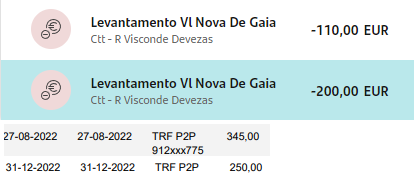

Divisão da Herança de Alberto Rocha
================

# Intro

Partindo dos pressupostos que

1)  Todas as despesas e receitas serão divididas pelos herdeiros na
    proporção de 5/8 para Ana Paula Rocha e 1/8 para cada um dos filhos
    de Alberto Rocha;

2)  A divisão da casa de Paredes de Coura foi feita equitativamente,
    tendo o imóvel sido vendido por \*\*\*\* € e o dinheiro já entregue
    a cada um dos herdeiros da seguinte forma, estando esse ponto
    encerrado:

- Ana Paula Rocha: **111562.5 €**
- Alberto Rocha: **22312.5 €**
- Cristina Rocha: **22312.5 €**
- Nair Rocha: **22312.5 €**

3)  Após a divisão integral do dinheiro resultante da venda da casa de
    Afe, herança regressou à situação inicial de ausência de capital
    disponível. Como tal, as despesas incorridas por ela desde o
    falecimento de Alberto Rocha (Pai) foram adiantadas por Ana Paula
    Rocha na qualidade de cabeça de casal da herança.

Numa primeira fase, foi realizado o pagamento de dívidas e créditos
pendentes. Os comprovativos referentes a esses

É apresentado um resumo dessa liquidação:

    ##                      Valor
    ## Liq. Oney 1           4395
    ## Liq. Oney 2           5105
    ## Liq. Wizink 1         8311
    ## Prest. Oney           2092
    ## Prest. Wizink         3198
    ## Divida a Luis Miguel 25000
    ## Total                48101
    ## 1/8                   6013

4)  Após a liquidação das dívidas e créditos pessoais conforme acordado
    na correspondência anterior, esse adiantamento por Ana Paula Rocha
    traduz-se num balanço entre os herdeiros de:

- Ana Paula Rocha: **18039 €**
- Alberto Rocha: **-6013 €**
- Cristina Rocha: **-6013 €**
- Nair Rocha: **-6013 €**

Com base neste ponto de partida, apresentam-se seguidamente propostas
para a divisão do património móvel da herança, bem como ressarcimento
das despesas incorridas pelos herdeiros no âmbito desta. O balanço
existente referido acima será actualizado após cada divisão, reflectindo
o valor que cabe a cada herdeiro. Como poderão ter notado, este
documento é um markdown, sendo por isso dinâmico e como tal não deve ser
entendido como uma proposta estática e final. Propostas de valores e
acréscimo de items por parte dos herdeiros serão facilmente
implementadas.

# Items

## Fiat Punto

Ana Paula Rocha propõe aos restantes herdeiros a aquisição do Fiat Punto
pelo valor de **3000 €**, valor superior aos valores propostos por
oficinas com stands ou revendedores dado a sua idade e desgaste
evidentes. O balanço após esta transação será de

- Ana Paula Rocha: **16914 €**
- Alberto Rocha: **-5638 €**
- Cristina Rocha: **-5638 €**
- Nair Rocha: **-5638 €**

## Mitsubishi Pajero Pinin

Alberto Rocha propõe aos restantes herdeiros a aquisição do Mitsubishi
Pajero Pinin (…) pelo valor de **3000 €**, valor superior aos valores
propostos por oficinas com stands ou revendedores dado a sua idade e
desgaste evidentes. O balanço após esta transação será de

- Ana Paula Rocha: **18789 €**
- Alberto Rocha: **-8263 €**
- Cristina Rocha: **-5263 €**
- Nair Rocha: **-5263 €**

## Recheio da Maia e de Paredes de Coura

Ana Paula Rocha propõe aos restantes herdeiros a aquisição dos recheios
das casa da Maia e Paredes de Coura pelo valor de **4000 €**. O balanço
após esta transação será de

- Ana Paula Rocha: **17289 €**
- Alberto Rocha: **-7763 €**
- Cristina Rocha: **-4763 €**
- Nair Rocha: **-4763 €**

## Despesas do Funeral

Alberto Rocha apresenta as despesas que assumiu com o funeral de Alberto
Rocha (Pai), no valor de de **5215.99 €**. Ana Paula Rocha recebeu para
esse efeito um subsídio no valor de **1329.6 €**, que será entregue a
Alberto Rocha para liquidação da dívida à Agência Funerária. O valor
restante da despesa (**3886.39 €**) será dividido entre os todos
herdeiros. O balanço após esta transação será de

- Ana Paula Rocha: **13530.41 €**
- Alberto Rocha: **-3032.81 €**
- Cristina Rocha: **-5248.8 €**
- Nair Rocha: **-5248.8 €**

## Despesas de armazenamento do recheio de Paredes de Coura

Para que fosse possível a venda da casa de Paredes de Coura, foi
necessário alugar um espaço de armazenamento para o recheio da mesma.
Esse espaço foi usado entre Setembro e Dezembro de 2022, conforme
apresentado em baixo. O valor total foi **764 €**.

O balanço após esta transação será:

- Ana Paula Rocha: **13052.91 €**
- Alberto Rocha: **-2364.31 €**
- Cristina Rocha: **-5344.3 €**
- Nair Rocha: **-5344.3 €**

## Despesas com a mudança do recheio de Paredes de Coura

Para efeitos da venda da casa de Paredes de Coura, Ana Paula Rocha
contratou os serviços da empresa de mudança José Alves em duas ocasiões:
Mudança de Afe para a Big Box em Gaia e, posteriormente, da Big Box para
a casa da Maia. Ambos os serviços foram pagos em dinheiros e os
respectivos movimentos são apresentados seguidamente. Os primeiros 3
movimentos referem-se ao levantamento fraccionado de **655 €** devido ao
limite de multibanco e mbway. O ultimo movimento corresponde à segunda
mudança, no valor de **250 €**.

o valor total é **905 €**. O balanço após esta transação será:

- Ana Paula Rocha: **13392.28 €**
- Alberto Rocha: **-2477.43 €**
- Cristina Rocha: **-5457.42 €**
- Nair Rocha: **-5457.42 €**

## Despesas de Águas e Saneamento de Paredes de Coura

Ana Paula Rocha apresenta à Herança as despesas com Água e Saneamento,
electricidade, contrato de telecomunicações (NOS) e jardinagem e da casa
de Paredes de Coura, incorridas até à venda da mesma. As despesas com
jardinagem foram **240 €**. As restantes despesas consistem de
mensalidades e estão discriminadas em seguida:

    ##        Mes Agua Electridade NOS
    ## 1    Junho  4.9          26  36
    ## 2    Julho  9.2          26  NA
    ## 3   Agosto  4.3          26  NA
    ## 4 Setembro   NA          27  NA
    ## 5  Outubro  1.0          25  NA
    ## 6 Novembro   NA          11  NA

para um total de **437.66 €**. O balanço após esta transação será:

- Ana Paula Rocha: **13556.4 €**
- Alberto Rocha: **-2532.14 €**
- Cristina Rocha: **-5512.13 €**
- Nair Rocha: **-5512.13 €**

## Despesas legais

Ana Paula Rocha apresenta despesas incorridas com Notária (**246.74 €**)
e Advogada (**250 €**) aquando do processo de habilitação de herdeiros.
Acrescenta ainda custos com certidões no valor de **60 €**. O balanço
após esta transação será :

- Ana Paula Rocha: **13765.18 €**
- Alberto Rocha: **-2601.73 €**
- Cristina Rocha: **-5581.72 €**
- Nair Rocha: **-5581.72 €**

# Resumo final da divisao

Seguidamente apresenta-se o resumo das operações consideradas
anteriormente. A coluna ‘check’ soma as parcelas individuais de cada
item. Todos os valores são em €, os valores diferentes de 0 resultam de
erros de arredondamento.

    ##                 AnaPaula Alberto Cristina  Nair Check
    ## inicial            18039   -6013    -6013 -6013  0.00
    ## punto              -1125     375      375   375  0.00
    ## jipe                1875   -2625      375   375  0.00
    ## mudancas             339    -113     -113  -113  0.12
    ## bigbox              -478     668      -96   -96  0.50
    ## funeral            -3759    4730     -486  -486  0.80
    ## recheio            -1500     500      500   500  0.00
    ## coura                164     -55      -55   -55  0.71
    ## despesas legais      209     -70      -70   -70  0.59
    ## Total              13765   -2602    -5582 -5582  0.72

Propõe-se assim que, estando todas as partes de acordo com as divisões
propostas acima e o apuramento dos respectivos balanços, sejam
liquidadas as diferenças apuradas. Ficarão assim concluídas as partilhas
da herança de Alberto Rocha, com excepção da casa da Maia, que é
discutida em seguida.

# Divisão da Casa da Maia

A casa da Maia foi avaliada por um perito certificado pela CMVM cujos
serviços estão disponíveis em <https://amsprojetos.pt/>. O valor
estimado para efeitos de partilha é de (**250000 €**). A análise que
fundamenta esta avaliação bem como o certificado energético que foi
pedido paralelamente estarão disponibilizados a todas as partes
interessadas.

Com base nesse valor, é proposto o seguinte:

A casa da Maia será adquirida por Alberto Jorge de Sousa Rocha, que para
o efeito contrairá um crédito de habitação no montante necessário para a
aquisição por tornas das partes correspondentes a Cristina Rocha e Nair
Rocha, cabendo a cada uma **31250** €

A esse valor será acrescentado o montante do acerto de contas descrito
anteriormente, decorrente da liquidação das dívidas e divisão dos bens
móveis, cabendo a Cristina Rocha e Nair Rocha o total de **25668.28** €
a cada.

Ana Paula Rocha receberá de Alberto Jorge de Sousa Rocha a importância
de **13765.18** correspondente ao seu próprio acerto de contas e à
redução efectuada nas tornas de Cristina Rocha e Nair Rocha.

**Este ultimo paragrafo depende de falarmos com o notario!!!**

No momento de formalização da partilha realizar-se-á a escritura da casa
em nome de Alberto Jorge de Sousa Rocha como único titular e a
formalização do crédito de habitação necessário para o processamento
desta operação. Mal esta seja finalizada, as tornas correspondentes a
Cristina Rocha e Nair Rocha serão imediatamente pagas. Será em seguida
formalizado em notário um contrato de pagamento de 100 € mensais a Ana
Paula Rocha e Luis Miguel Martins Pereira, durante 782 meses, perfazendo
o pagamento de 78125 € correspondente aos 31.25% da titularidade da casa
da maia de que abdicaram no processo.
